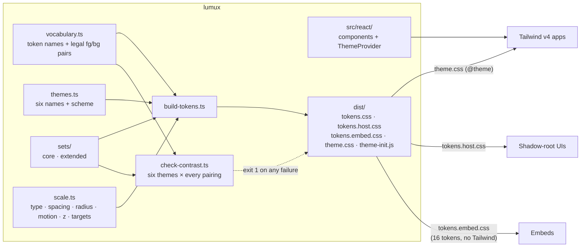
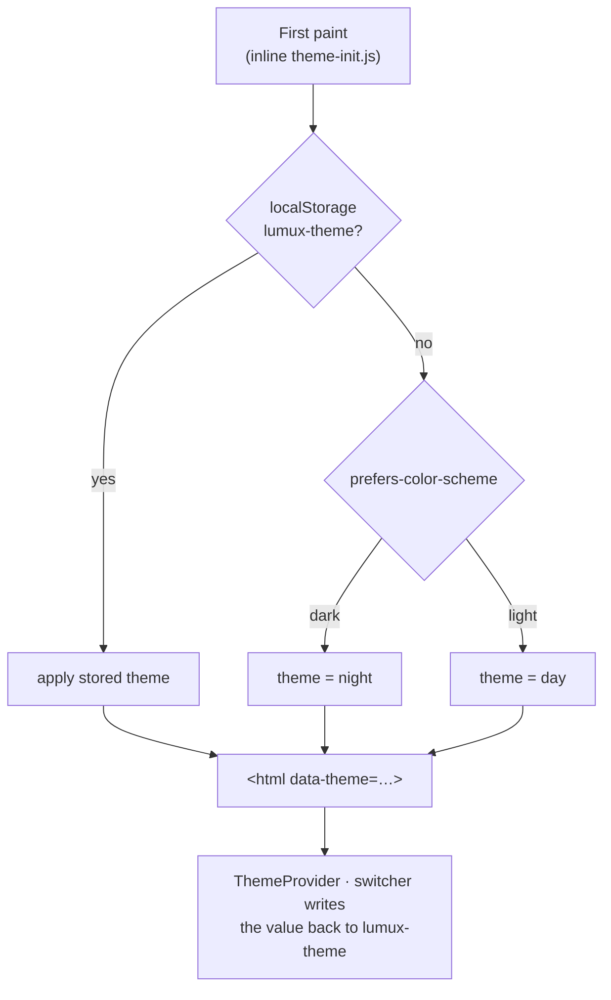

<h1 align="center">lumux</h1>

<p align="center">
  <strong>Accessible themes and components, with contrast enforced at build time.</strong><br>
  Six WCAG 2.2 AAA themes, one semantic token vocabulary, one React component set.
</p>

<p align="center">
  <a href="https://danieloceno.github.io/lumux/"><strong>Live demo</strong></a> ·
  <a href="./docs/getting-started.md">Getting started</a> ·
  <a href="./docs/tokens.md">Tokens</a> ·
  <a href="./docs/components.md">Components</a> ·
  <a href="./docs/gates.md">Gates</a>
</p>

<p align="center">
  <a href="https://github.com/danieloceno/lumux/actions/workflows/ci.yml"></a>
  <a href="https://danieloceno.github.io/lumux/"></a>
  <a href="#status"></a>
  <a href="./LICENSE"></a>
</p>

<p align="center">
  <a href="#accessibility"></a>
  <a href="#accessibility"></a>
  <a href="#accessibility"></a>
  <a href="#themes"></a>
  <a href="#themes"></a>
</p>

<p align="center">
  <a href="#stack"></a>
  <a href="#stack"></a>
  <a href="#stack"></a>
  <a href="#stack"></a>
  <a href="#versioning"></a>
</p>

---

## Table of contents

- [Why lumux](#why-lumux)
- [Status](#status)
- [Quick start](#quick-start)
- [How it fits together](#how-it-fits-together)
- [Themes](#themes)
- [Accessibility](#accessibility)
- [Components](#components)
- [Gates](#gates)
- [Principles](#principles)
- [Stack](#stack)
- [Package contents](#package-contents)
- [Repo layout](#repo-layout)
- [Development](#development)
- [Versioning](#versioning)
- [Contributing](#contributing)
- [Documents](#documents)
- [License](#license)

---

## Why lumux

Accessibility is usually a review step. In lumux it is a property of the system. A colour pair that fails contrast breaks the build. A control smaller than 44px cannot be built. A dark theme is authored, not inverted.

Every app that adopts lumux uses the same semantic tokens, mounts the same components and runs the same gates. Changing the palette means changing one file, and moving between apps means relearning nothing.

## Status

| Area | Scope | State |
|---|---|---|
| Tokens & themes | Token source of truth, six AAA themes, contrast gate, focus and motion primitives | ✅ Shipped · [`docs/tokens.md`](./docs/tokens.md) |
| Components | React 19 set on Radix: actions, forms, overlays, content, toasts | ✅ Shipped · [`docs/components.md`](./docs/components.md) |
| Gates | className, disabled-title and nested-scroller checks, installable into any consumer | ✅ Shipped · [`docs/gates.md`](./docs/gates.md) |
| `1.0.0` | API freeze | ⏳ Planned |

Pre-release: expect breaking changes before `1.0.0`. Pin an exact tag.

## Quick start

```sh
npm i github:danieloceno/lumux#v0.3.0
```

```css
/* app.css */
@import "tailwindcss";
@import "lumux/tokens.css";
@import "lumux/theme.css";
@source "../node_modules/lumux/dist/react";
```

Inline the pre-paint script in `<head>`, before any CSS, so a stored dark theme never flashes light:

```html
<script>try{var t=localStorage.getItem("lumux-theme");if(["day","night","dawn","midnight","forest","ocean"].indexOf(t)>-1)document.documentElement.setAttribute("data-theme",t)}catch(e){}</script>
```

```tsx
import { AppShell, Button, ThemeProvider, ThemeSwitcher, THEME_NAMES } from "lumux/react";

export function App() {
  return (
    <ThemeProvider>
      <AppShell header={<ThemeSwitcher themes={THEME_NAMES} className="ml-auto" />}>
        <Button onClick={save}>Save</Button>
      </AppShell>
    </ThemeProvider>
  );
}
```

No React? `import { applyTheme } from "lumux/theme"` handles theme selection and persistence without a framework. The full walkthrough is in [docs/getting-started.md](./docs/getting-started.md).

## How it fits together



CSS custom properties are the contract. Tailwind v4 reads them through `theme.css`. Embeds and shadow roots use them directly, without Tailwind.

## Themes

Six themes in two families, all on one vocabulary, all at AAA.

- **core** (`day` / `night`): the default pair. `system` resolves to it.
- **extended** (`dawn` / `midnight` / `forest` / `ocean`): each keeps its source palette's hue and saturation. Only lightness moved, until every pair passed.

| `data-theme` | Scheme | Canvas / surface | Accent |
|---|---|---|---|
| `day` | light | `#f6f8fa` / `#ffffff` | `#005778` |
| `night` | dark | `#0a1d2a` / `#112634` | `#00cde0` |
| `dawn` | light | `#fdfcfb` / `#ffffff` | `#4326d5` |
| `midnight` | dark | `#0e0e11` / `#17171c` | `#b69ffa` |
| `forest` | light | `#f3f6f5` / `#ffffff` | `#1a5a3a` |
| `ocean` | dark | `#0f131a` / `#171d26` | `#24c0f3` |

`npm run check:contrast` checks 378 legal pairs, 63 per theme: text at 7:1, and boundaries, focus rings and chart marks at 3:1. Full values are in [docs/tokens.md](./docs/tokens.md). [`src/tokens/sets/extended.ts`](./src/tokens/sets/extended.ts) has the derivation notes.



- One `<html>` attribute selects the theme: `data-theme`.
- The choice persists in `localStorage["lumux-theme"]`. Embeds never persist it.
- The CSS always ships all six themes. An app offers a subset through `<ThemeSwitcher themes={…}>`.

## Accessibility

WCAG 2.2 **AAA wherever achievable, AA as the floor**. Each rule is enforced, not left to reviewers.

| Criterion | lumux rule | Enforced by |
|---|---|---|
| 1.4.6 Contrast (Enhanced) | Every text pair 7:1 in all six themes, with no large-text discount | `check-contrast.ts` in CI (exit 1 on failure), axe in the e2e harness |
| 1.4.11 Non-text contrast | Control edges, focus rings and chart marks 3:1 on every surface | `check-contrast.ts` |
| 2.5.5 Target size (Enhanced) | 44 × 44px minimum for every pointer, dense layouts included | e2e measures every target in every theme, density and viewport |
| 2.4.13 Focus appearance | 2px solid outline, never obscured, one definition, forced-colors safe | Focus primitive, per-element focus-visible diff in e2e |
| 2.1.3 Keyboard (no exception) | Everything works without a pointer; nothing depends on hover | Component contracts, manual screen-reader pass |
| 2.2.3 No timing | No time limits; error toasts never auto-dismiss | `ToastProvider`, `role=alert`, a reachable toast log |
| 2.3.3 Animation from interactions | Motion tokens collapse under `prefers-reduced-motion` | Motion primitive |
| 2.4.1 Bypass blocks | Skip link in every app shell | `AppShell`, e2e |
| 1.3.5 / 3.3.x Forms | `autocomplete` on every field; errors as icon + text with `role=alert` and `aria-invalid` | `Field`, `eslint-plugin-jsx-a11y` strict config |

The trade-offs were accepted up front: there is no `sm` button size, dark accents read paler than their 4:1 originals, and brand colours that cannot reach 7:1 are kept for brand marks only.

UI code cannot gate content-level criteria such as reading level (3.1.5). They live in [docs/copy.md](./docs/copy.md) as guidance, not as claims.

## Components

Imported from `lumux/react`. Each one documents the accessibility behaviour it guarantees in [docs/components.md](./docs/components.md).

| Group | Components |
|---|---|
| Shell & theme | `AppShell`, `SkipLink`, `useDocumentTitle`, `ThemeProvider`, `useTheme`, `ThemeSwitcher`, `IconProvider` |
| Actions | `Button`, `IconButton`, `LinkButton`, `ConfirmInline`, `Spinner` |
| Forms | `Field`, `Input`, `Select`, `Textarea`, `Checkbox`, `RadioGroup`, `Switch`, `SegmentedControl` |
| Overlays | `Dialog`, `Sheet`, `Drawer`, `Menu`, `Popover`, `Tooltip` |
| Content | `Card`, `Badge`, `EmptyState` |
| Feedback | `ToastProvider`, `useToast`, `ToastLog`, `useToastLog` |

The [live demo](https://danieloceno.github.io/lumux/) shows every component in every state, in all six themes. The e2e suite runs against that same page.

## Gates

Three scripts that fail the build on UI defects that reviews miss. lumux runs them on itself, and `install-gates.sh` installs them into any consumer with a frozen baseline.

| Gate | Catches |
|---|---|
| `check-ui-className.mjs` | Appearance overrides on primitives, raw palette classes, arbitrary values, controls under 44px, off-scale icons, opacity on text, prose over 90 characters |
| `check-disabled-title.sh` | A disabled control whose only reason is a `title` |
| `check-nested-scrollers.sh` | An `overflow-*` with no written reason |

```sh
bash node_modules/lumux/scripts/install-gates.sh --src src
```

Config, ratchets and blind spots are in [docs/gates.md](./docs/gates.md).

## Principles

**Semantic tokens, never raw values.** Apps reference `background`, `foreground`, `accent`, `danger`. Never a hex, a pixel or a per-component colour.

**Every theme is authored.** A dark theme is not an inverted light one. Each of the six is designed and verified on its own.

**Identical everywhere.** Same component, same behaviour, same measurements, same copy conventions. A deviation is a documented variant with a stated reason.

**Mobile-first.** The scale enforces touch targets, thumb reach and safe areas. Layouts hold at 200% zoom and at 320px.

**Say less.** Redundant helper text is a defect. Labels, errors, state announcements and accessible names always stay. Helper text is capped at 90 characters.

**Maintainable by a small team.** No Storybook, no visual-regression SaaS, no token toolchain. One playground, one test suite, plain TypeScript.

## Stack

| Layer | Choice |
|---|---|
| Token contract | CSS custom properties, generated from TypeScript sources |
| Utility layer | Tailwind v4 `@theme` |
| Components | React 19 on Radix primitives |
| Toasts | Own `ToastProvider`: errors sticky, success auto-dismisses |
| Type | Inter Variable + Geist Mono, self-hosted by the app |
| Icons | lucide-react 1.x |
| Testing | `node --test`, Playwright + axe-core |

## Package contents

| Subpath | Contents |
|---|---|
| `lumux/tokens.css` | All six themes, density, focus, motion, base rules |
| `lumux/theme.css` | Tailwind v4 `@theme` mapping |
| `lumux/tokens.embed.css` | 16-token `:host` subset for embeds, minified, no Tailwind |
| `lumux/tokens.host.css` | Every token on `:host`, for UI inside shadow roots |
| `lumux/theme-init.js` | Pre-paint script, to inline |
| `lumux/theme` | `applyTheme`, `readTheme`, `resolvedTheme`, `resolvedScheme`, `THEME_NAMES` |
| `lumux/react` | Components, `ThemeProvider`, `ThemeSwitcher` |
| `lumux/eslint` | `eslint-plugin-jsx-a11y` strict config |
| `scripts/install-gates.sh` | Installs the three gates and a frozen baseline into a consumer |

## Repo layout

```
lumux/
├── src/
│   ├── tokens/
│   │   ├── vocabulary.ts     token names + legal fg/bg pairings
│   │   ├── themes.ts         the six theme names and their light/dark scheme
│   │   ├── sets/             core.ts (day, night) · extended.ts (dawn, midnight, forest, ocean)
│   │   └── scale.ts          type · spacing · radius · motion · z · targets
│   ├── theme/                applyTheme · readTheme · resolvedTheme, framework-free
│   └── react/                one file per component, barrel index
├── scripts/
│   ├── build-tokens.ts       → dist/
│   ├── check-contrast.ts     six themes × every pairing, exit 1 on failure
│   ├── check-*.{mjs,sh}      the three gates
│   ├── install-gates.sh      copies the gates and a frozen baseline into a consumer
│   └── release.sh            builds dist/, commits it, tags vX.Y.Z
├── eslint/a11y.js            jsx-a11y strict config, exported as lumux/eslint
├── playground/               the demo page, also driven by the e2e harness
├── tests/                    unit (node --test) · e2e (Playwright + axe)
└── docs/                     getting-started · tokens · components · gates · copy
```

## Development

```sh
npm ci
npm run check        # typecheck, lint, contrast, gates, build, unit
npm run e2e          # axe, 44px targets, focus, 320px / 200% zoom, every theme
npm run playground   # the demo page on localhost:5179
```

CI runs both suites on every PR. Every push to `main` publishes the demo to GitHub Pages. A red gate is never bypassed.

## Versioning

Semantic versioning on git tags, with `dist/` committed on the tag commit only. Token renames and removals are breaking. Removed tokens ship as deprecated aliases for one minor before deletion. Pin an exact tag and upgrade on purpose; updates never arrive silently.

```sh
npm run release -- X.Y.Z   # from a clean main
```

## Contributing

1. A new token or component needs a real use in at least two apps. One-off needs stay in the app.
2. Every PR passes `npm run check` and `npm run e2e`.
3. Commits follow [Conventional Commits](https://www.conventionalcommits.org/).

## Documents

| Document | Purpose |
|---|---|
| [docs/getting-started.md](./docs/getting-started.md) | Adopting lumux: install, CSS, `<head>`, React root, lint, CI, shadow roots |
| [docs/tokens.md](./docs/tokens.md) | Token reference: the six themes, every colour, type, spacing, motion, focus |
| [docs/components.md](./docs/components.md) | Component contracts, props and the a11y behaviour each one guarantees |
| [docs/gates.md](./docs/gates.md) | The three gates: what each catches, install, config, ratchets, blind spots |
| [docs/copy.md](./docs/copy.md) | UI copy rules and what is never removed |

## License

[MIT](./LICENSE)

---

<p align="center"><sub>lumux · accessibility as a property of the system, not a review step</sub></p>
